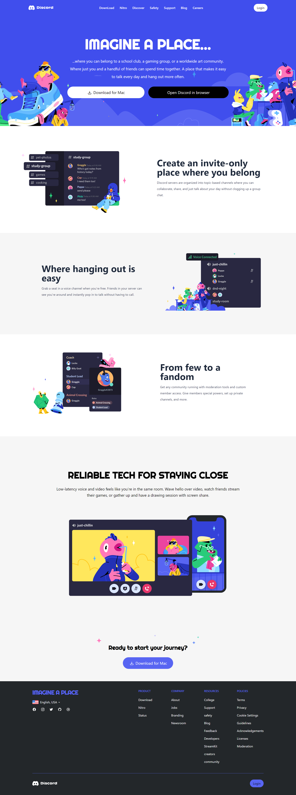

# Discord Clone

The project contains clone of Homepage `discord.com`. This is a fully responsive clone of Discord.com build purely with `HTML`, `Css`, `Javascript` and `Tailwind Css`. Utilised the efficient power of tailwind css to build this full responsive clone. 
Learnt to use tailwind css to build production ready UI's in minimum time possible. 

# Technologies Used

 `HTML`

 `CSS`

 `Javascript`

 `Tailwind CSS`

# Features
 - Build over HTML and CSS.
 - Styled using Tailwind CSS which offers stable and responsive design.
 - Clean and Beautiful UI Design
 - Fully Responsive Mobile Design

 # Website
 

 # Mobile Responsive Design

 

 

 # Contact

  [Linkedin](https://www.linkedin.com/in/deepaksingh5219/)

 [Instagram](https://www.instagram.com/deepak_singh_5219/)

 [Hashnode](https://devdeepak.hashnode.dev/)

 [Portfolio](https://devdeepak.vercel.app/)

